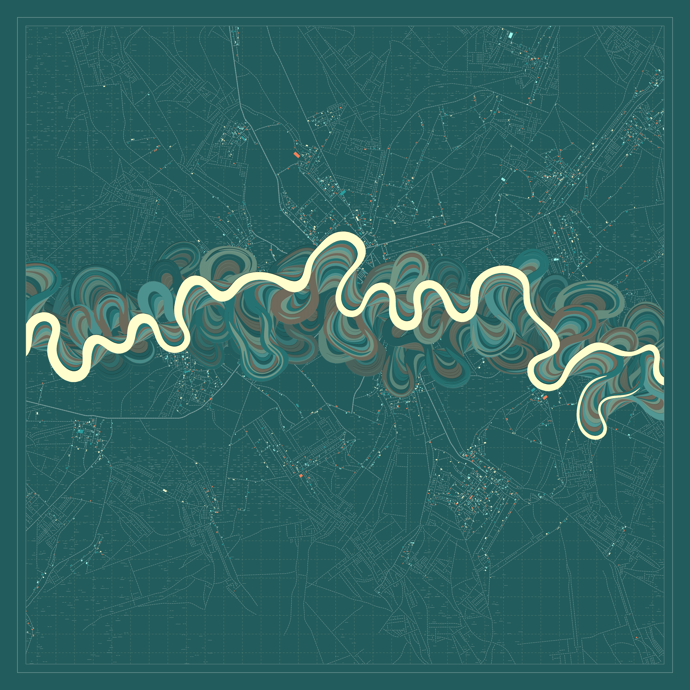
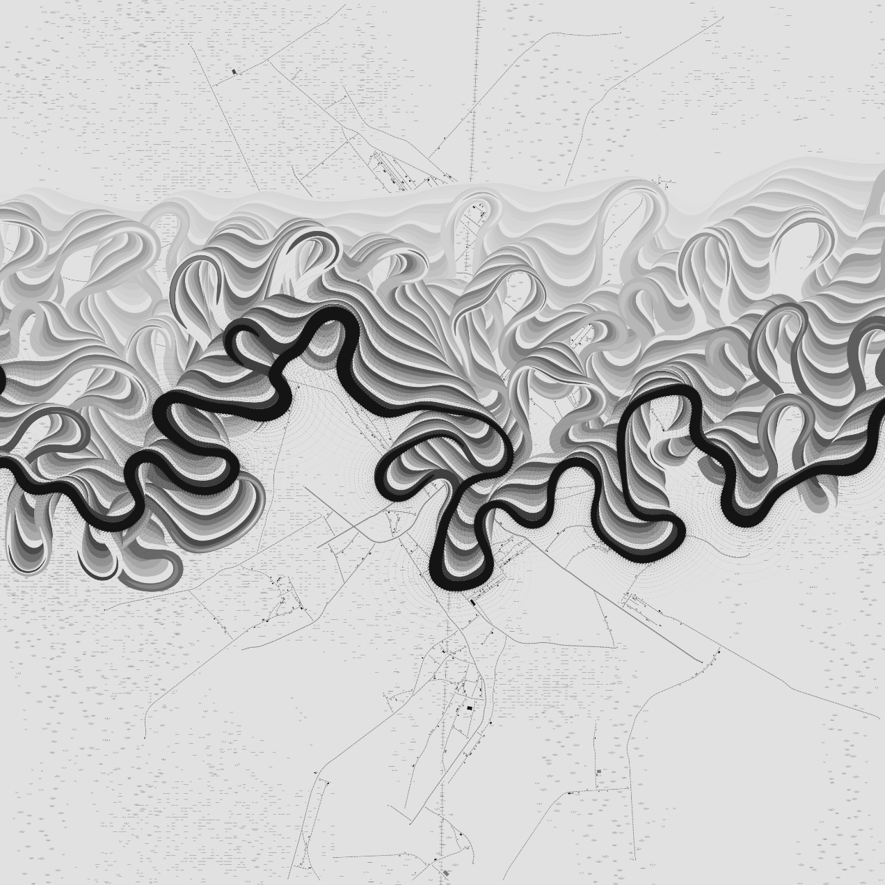
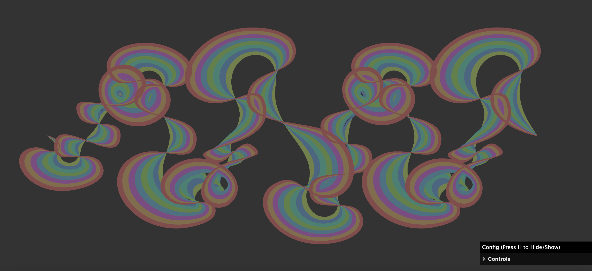
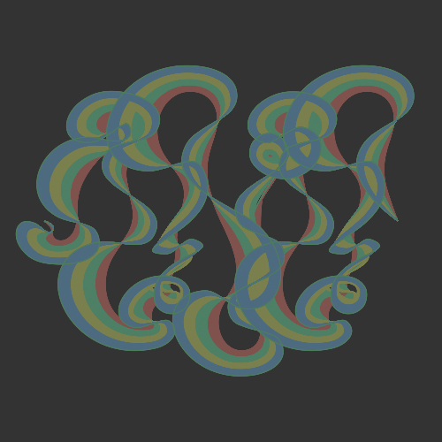

# Quiz-8
## Part 1: Imaging Technique Inspiration
**Example: Ancient Courses of Fictional Rivers by Robert Hodgin**

This artwork is a generative artwork that constructs river-like visual systems through computational processes. 

I am very interested in how this kind of work builds complex, river-like line structures through gradual accumulation of dynamic changes. It is not about drawing fixed shapes. Instead, it evolves over time, with constantly changing flow lines, then branching out into lines resembling those of a city, gradually forming the image. 

I hope to incorporate this concept and trend of organic development into my project. By using lines and recording their trajectories, I aim to express the intangible power and the depth of space. It can create complex and atmospheric visual effects, which are in line with dynamic, multi-layered and constantly changing synthesis techniques. 

## Part 2: Coding Technique Exploration
**Technique: Alpha Blending**

This technique I intend to employ is based on the growth and iterative drawing of lines, as well as the continuous retention of trajectories. By continuously updating and redrawing slightly offset curves, this system creates a sense of temporal hierarchy, where previous states remain visible as traces. This results in a visual effect of accumulated history and flowing motion. It helps achieve the result I desire by simulating the formation of organic trajectories, allowing the lines to evolve over time.

[Link to Coding Interface](https://brianhonohan.com/sketchbook/p5js/meandering-river-02/)

